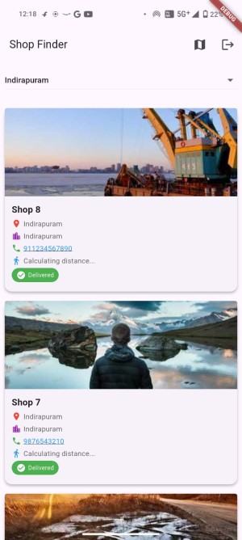
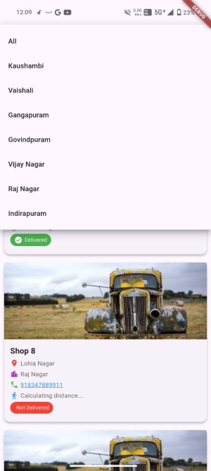
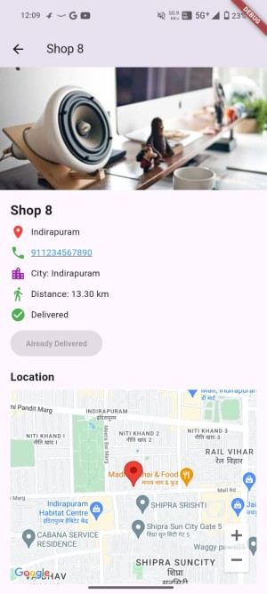
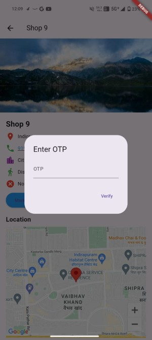

# 🛒 SalesTrack - Flutter App

SalesTrack is a Flutter-based mobile application for tracking shop deliveries. It includes Firebase authentication, city-based shop selection, shop listing with distance sorting, and OTP verification for marking deliveries.

---

## 🚀 Features
✅ **Firebase Phone Authentication** - Secure login using OTP  
✅ **City Selection** - Fetches cities dynamically from Firestore  
✅ **Shop Listing** - Displays shops sorted by increasing distance  
✅ **Live Location & Distance Calculation** - Uses Geolocator to sort shops  
✅ **Shop Details Page** - Shows shop location on map  
✅ **OTP Verification for Delivery** - Ensures secure delivery confirmation  
✅ **Bloc State Management** - Efficient state handling  

---

## 📸 Screenshots

| Home Screen | Locality Selection | Shop Details| OTP Verification |
|-------------|---------------|--------------|--------------|
|  |  |  |  |


---


## 🎥 Demo Video


## 🛠️ Installation & Setup

1️⃣ Clone the repository:
```sh
git clone https://github.com/Nutan-Kum12/salestrack.git
cd salestrack

A few resources to get you started if this is your first Flutter project:

- [Lab: Write your first Flutter app](https://docs.flutter.dev/get-started/codelab)
- [Cookbook: Useful Flutter samples](https://docs.flutter.dev/cookbook)

For help getting started with Flutter development, view the
[online documentation](https://docs.flutter.dev/), which offers tutorials,
samples, guidance on mobile development, and a full API reference.
